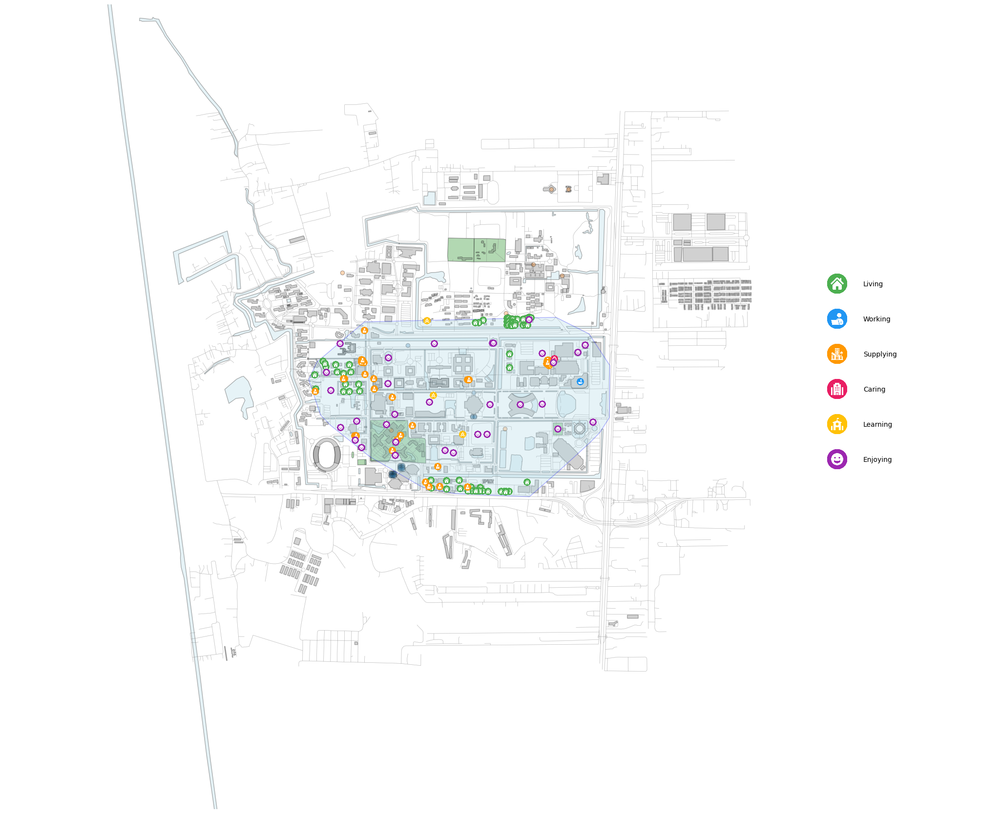

# DSI Walking Map 🚶‍♀️🗺️

[](https://colab.research.google.com/github/storemesh/dsi-open-street/blob/main/example/example_notebook.ipynb)

A Python library to fetch, process, and visualize walkable city data from OpenStreetMap. Given a central coordinate, it calculates the area reachable within a specified walking time and generates various map visualizations. This tool is ideal for urban planning, real estate analysis, or anyone interested in exploring urban walkability.

---
## ✨ Features

* **Walkable Area Calculation**: Computes the reachable street network and its corresponding area (convex hull) based on walking time and speed.
* **OSM Data Fetching**: Downloads land use, buildings, amenities, and other features from OpenStreetMap.
* **Automatic Feature Classification**: Categorizes geographic features into logical groups like 'Building', 'Water', and 'Tree', and classifies amenities into services like 'Living', 'Caring', and 'Enjoying'.
* **Rich Visualizations**:
    * Generate a complete map (`output`) with all layers and custom service icons.
    * Generate a clean basemap (`basemap`) without service icons.
    * Generate individual maps for each primary layer: `street`, `building`, and `water`.

---

## 🚀 Installation

You can install the library directly from the GitHub repository using `pip`.

```python
!pip install git+https://github.com/storemesh/dsi-open-street.git
```
---
## Usage Example
The following script demonstrates how to import the library and generate all available map types.

```python
import matplotlib.pyplot as plt
from dsi_walking_map import WalkerMap
```

#### 1. Define the coordinates for the center of your map
```python
lat, lon = 14.072134, 100.608261 # Example: Thammasat University, Rangsit Campus
```

#### 2. Create a WalkerMap object. This will fetch and process all data.
```python
obj = WalkerMap(lat, lon)
```

#### 3. Generate and display individual layer maps
```python
print("\nPlotting Street layer...")
fig_street, ax_street = obj.street()
ax_street.set_title("Street Network", fontsize=16)
plt.show()

print("Plotting Building layer...")
fig_building, ax_building = obj.building()
ax_building.set_title("Building Footprints", fontsize=16)
plt.show()

print("Plotting Water layer...")
fig_water, ax_water = obj.water()
ax_water.set_title("Water Bodies", fontsize=16)
plt.show()
```

#### 4. Generate a basemap (all layers combined, no service icons)
```python
# - Without the 15-minute walk area overlay
print("Plotting the basemap without the area overlay...")
fig_base_no_area, ax_base_no_area = obj.basemap(area=False)
ax_base_no_area.set_title("Basemap without Walkable Area", fontsize=18)
plt.show()

# - With the 15-minute walk area overlay
print("Plotting the basemap with the area overlay...")
fig_base_with_area, ax_base_with_area = obj.basemap(area=True)
ax_base_with_area.set_title("Basemap with 15-Minute Walkable Area", fontsize=18)
plt.show()
```

#### 5. Generate the final, complete map with service icons and legend
```python
print("Plotting the final combined map with services...")
fig_main, ax_main = obj.output()
ax_main.set_title("15-Minute City Services Map", fontsize=20)
plt.show()
```


---
## 🖼️ Example Outputs

Here are some examples of the maps generated by this library.


